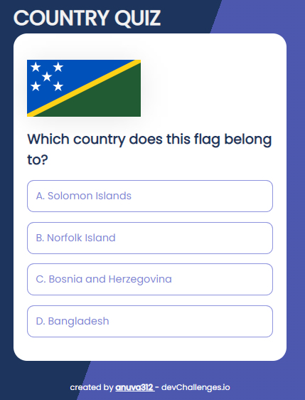
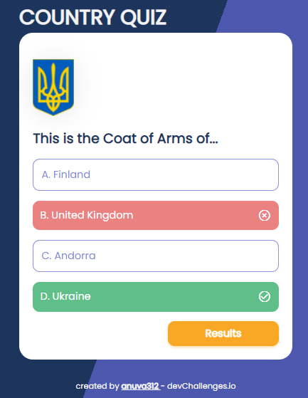
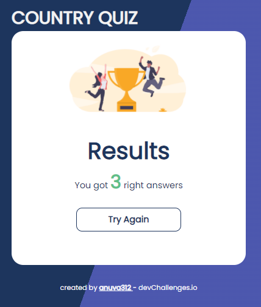

# Country

Solution for the [Country Challenge](https://devchallenges.io/challenges/Bu3G2irnaXmfwQ8sZkw8) from [Devchallenges.io](https://devchallenges.io).

<!-- TABLE OF CONTENTS -->

## Table of Contents

- [Challenge](#challenge)
- [Solution](#solution)
  - [Demo](#demo)
  - [Built With](#built-with)
- [How to Use](#how-to-use)
- [Acknowledgements](#acknowledgements)

<!-- Challenge -->

## Challenge

Challenge: Create a country quiz app using an API. Use Front-end libraries like React or Vue.
Fulfill user stories below:

- User story: I can see at least 2 types of questions: a city is the capital of.. or a flag belong to country..
- User story: I can select an answer
- User story: I can see if my answer is correct or incorrect
- User story: When I answer correctly, I can move on to the next question
- User story: When I answer incorrectly, I can see my results and try again
- User story: I can try again

<!-- Solution -->

## Solution

### Demo

Find the site in action [here]()!

#### Quiz Question



#### With answer



#### Results Page



### Built With

- [React](https://reactjs.org/)

## How To Use

To clone and run this application, you'll need [Git](https://git-scm.com) and [yarn](https://yarnpkg.com/). From your command line:

```bash
# Clone this repository
$ git clone https://github.com/{your-user-name}/{your-project-name}

# Install dependencies
$ yarn install

# Run the app
$ yarn start
```

## Acknowledgements

- [How To Make A Loader](https://www.w3schools.com/howto/howto_css_loader.asp)
- [REST Countries](https://restcountries.com/)
